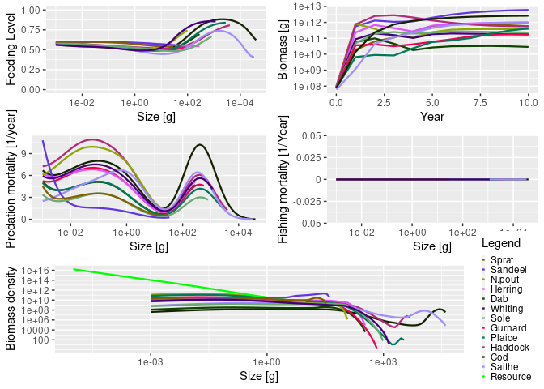

<!-- README.md is generated from README.Rmd. Please edit that file -->

# mizer

[](https://cran.r-project.org/package=mizer)
[](https://travis-ci.org/sizespectrum/mizer)
[](https://codecov.io/github/sizespectrum/mizer?branch=master)
[](https://cran.r-project.org/package=mizer)
[](http://www.rdocumentation.org/packages/mizer)

Mizer is an R package to run multi-species size-spectrum models of fish
communities. The package has been developed to model marine ecosystems
that are subject to fishing. However, it may also be appropriate for
other ecosystems.

The package contains routines and functions to allow users to set up an
ecosystem model, and then project it through time under different
fishing strategies. Methods are included to explore the results,
including plots and calculation of community indicators such as the
slope of the size spectrum. Size-based models can be complicated so
mizer contains many default options that can be easily changed by the
user.

<!-- Mizer can also be used to create web apps that allow users to explore models -->

<!-- without the need to install R. An [example of such an -->

<!-- app](https://mizer.shinyapps.io/selectivity/) investigates the effect of -->

<!-- switching to a gear with a T90 extension net to reduce the catches of undersize -->

<!-- hake and red mullet -->

Mizer has been supporting research in marine ecology and fisheries
science since 2014 ([see
publications](https://sizespectrum.org/mizer/articles/publications.html).
It is still under active development. The new version 2.0 has increased
the user-friendliness and the flexibility of the framework.
Contributions from the user community are very welcome. There is a
sister package called
[mizerExperimental](https://sizespectrum.org/mizerExperimental) where
user contributions can be checked out and receive feedback from the
community. Example mizer models can be contributed to
[mizerExamples](https://sizespectrum.org/mizerExamples).

Does your project or publication use mizer? If so, we would love to
know. You can also join our Google Discussion group here:
<https://groups.google.com/forum/#!forum/size-spectrum-models>

Recent work on mizer was funded by the European Commission Horizon 2020
Research and Innovation Programme under Grant Agreement No 634495 for
the project MINOUW (<http://minouw-project.eu/>) and the Australian
Research Council Discovery Project [Rewiring Marine Food
Webs](http://marinesocioecology.org/rewiring-marine-food-webs/).

## Installation

The package is on [CRAN](https://cran.r-project.org/package=mizer) and
therefore available from R’s built-in package manager.

``` r
# Install release version from CRAN
install.packages("mizer")

# Alternatively, install development version from GitHub
devtools::install_github("sizespectrum/mizer")
```

## Example

The following code loads the mizer package, loads some information about
species in the North Sea that comes as an example with the package, sets
up the parameters for the mizer model, and runs a simulation for 10
years.

``` r
library(mizer)
params <- newMultispeciesParams(NS_species_params, inter)
sim <- project(params, t_max = 10, effort = 0)
```

The results of the simulation can then be analysed, for example via
plots:

``` r
plot(sim)
```

<!-- -->

See the accompanying [Get started](articles/mizer.html) page for more
details on how the package works, including detailed examples.
